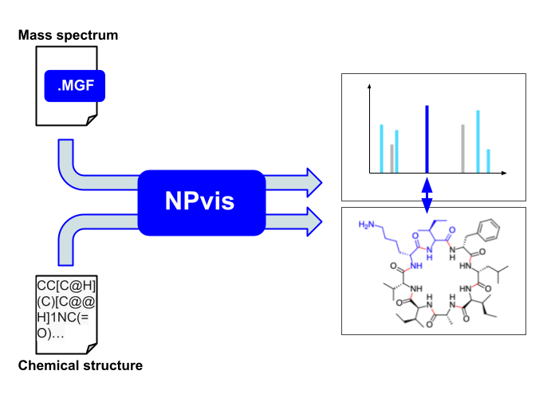
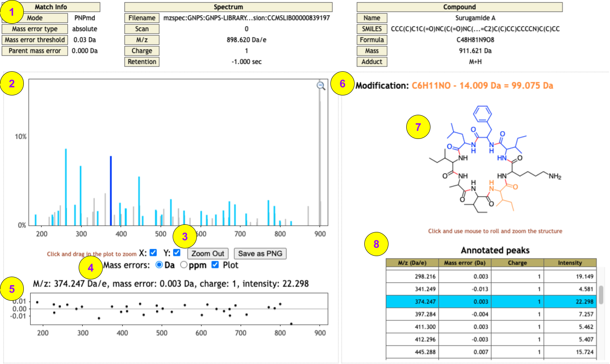

# NPvis

Interactive Visualizer of Peptidic Natural Product–MS/MS Matches

## Short info

NPvis takes as input a chemical structure and related tandem mass spectrum (MS/MS), annotates their match, and allows users to
interactively map annotated spectrum peaks to the corresponding structure fragments and assess the match correctness.
Currently, NPvis works best with Peptidic Natural Products (PNPs) that include ribosomal (RiPPs) and nonribosomal peptides (NRPs). 
We plant to support general secondary metabolites, such as polyketides, terpenes, and lipids, in the future NPvis versions.

One of the key NPvis features is the ability to work even if the exact chemical structure of the matching PNP is unknown and 
only a modified or mutated variant of that PNP is available. 
We name this running mode as "PNP with modification" and consider the mass difference between the provided spectrum and structure 
as the mass of an (unknown) modification. NPvis locates the most likely modification position in the PNP structure and 
highlights the affected PNP fragment in the interactive report. The MS/MS peaks are annotated relying on this information. 
You can read more about the modification-tolerant PNP matching in [Gurevich et al, 2018](https://www.nature.com/articles/s41564-017-0094-2).

NPvis was developed in the [Center for Algorithmic Biotechnology (CAB)](http://cab.spbu.ru), St. Petersburg State University 
within the [RSF 20-74-00032 project](https://cab.spbu.ru/grant/rsf-20-74-00032/).

* Find [**more information**](http://cab.spbu.ru/software/npvis/) on NPvis and interactive output examples on the CAB website 
* Try the NPvis web service [**here**](http://cab.cc.spbu.ru/npvis/) (**recommended way** to use the tool!)
* Explore the source code of the 
[console utility](https://github.com/ablab/NPvis/tree/main/console_utility) and [web service](https://github.com/ablab/NPvis/tree/main/webservice)
* Download the console [release](https://github.com/ablab/NPvis/releases) 
* Post a question or a bug report on the project [issue tracker](https://github.com/ablab/NPvis/issues)

**Below** we explain NPvis **inputs** and **outputs**. 
For hints on the **web service usage** (controls, GET Requests) click [**here**](https://github.com/ablab/NPvis/tree/main/webservice/README.md), 
for the **console tool** (installation, command-line options) click [**here**](https://github.com/ablab/NPvis/tree/main/console_utility/README.md). 

## Input data formats

NPvis takes a *single* compound (chemical structure) and a *single* spectrum (MS/MS) as input. 
We accept the most common chemical and spectral formats. If your data are unsupported, please use the converters specified below 
or [post a feature request](https://github.com/ablab/NPvis/issues), we will try to implement the support in future releases.
You can find sample data to test the tool [here](https://github.com/ablab/NPvis/tree/main/test_data). 

### Compounds (PNPs)

We accept chemical structures in [SMILES](https://en.wikipedia.org/wiki/Simplified_molecular-input_line-entry_system) and 
[MDL MOL V3000](http://biotech.fyicenter.com/1000250_What_Is_SDF_Mol_V3000_File_Format.html). 
You can use Chemaxon's [molconvert](https://docs.chemaxon.com/display/docs/molconvert.md) or [RDKit](https://www.rdkit.org/) to convert your data to these formats. 

### Spectra

We accept centroided tandem mass spectra (MS/MS or MS2) in 
the [MGF](https://fiehnlab.ucdavis.edu/projects/lipidblast/mgf-files), 
[mzXML](http://tools.proteomecenter.org/wiki/index.php?title=Formats:mzXML), and 
[mzML](https://www.psidev.info/mzML) formats. Note that if your spectra files contains multiple scans, e.g., it is an mzXML file, 
you should specify a particular scan for matching!
You can use ProteoWizard's [msconvert](https://proteowizard.sourceforge.io/tools.shtml) to convert your data to these formats.

## Output (NPvis reports)

The Figure above shows an NPvis report for the [CCMSLIB00000839197](https://gnps.ucsd.edu/ProteoSAFe/gnpslibraryspectrum.jsp?SpectrumID=CCMSLIB00000839197#%7B%7D) spectrum from the [GNPS spectral library](https://ccms-ucsd.github.io/GNPSDocumentation/gnpslibraries/) matched with 
the [surugamide A](https://pubchem.ncbi.nlm.nih.gov/compound/71764189) structure in the "PNP with modification" mode. 
This report was generated via the [web service](http://cab.cc.spbu.ru/npvis/) by pressing the Load Sample Data and Submit buttons; the same report generated via the console tool or a <a href="http://cab.cc.spbu.ru/npvis/?smiles=CC[C@H](C)[C@H]1C(=O)N[C@@H](C(=O)N[C@H](C(=O)N[C@H](C(=O)N[C@@H](C(=O)N[C@@H](C(=O)N[C@H](C(=O)N[C@@H](C(=O)N1)C)[C@@H](C)CC)CC(C)C)CC2=CC=CC=C2)[C@@H](C)CC)CCCCN)[C@H](C)CC&gusi=mzspec:GNPS:GNPS-LIBRARY:accession:CCMSLIB00000839197&errthr=0.05&errtype=da">GET Request</a> might slightly differ.  

The key report elements/controls are:
1. The Metadata panel informs about the provided spectrum and compound and the match (NPvis) parameters.   
2. The zoomable Spectrum panel highlights annotated (sky blue) and not-annotated (grey) MS/MS peaks. 
The annotated peaks are clickable (see also #7-8). In this example, the panel is zoomed along the Y-axis to the 15% intensity level.
3. The Zoom controls enable zooming along X- and Y-axis alone or together. You may also zoom out to the default view. 
The Save as PNG button exports the currently zoomed area as an PNG image. 
4. The Mass errors panel allows switching between absolute (in Da) and relative (in ppm) peaks annotation errors. 
We call an observed MS/MS peak annotated by a fragment if their masses are within a 
configurable threshold (0.03 Da by default, specified in #1). 
You may show/hide the error plot for all peaks in the zoomed area (see #5) by clicking on the corresponding checkbox. 
5. The hideable mass error plot of discrepancies between the masses of the annotated peaks and the corresponding structure fragments (see also #4).
6. The Modification information (present in the "PNP with modification" mode only!) tells the calculated modification/mutation mass and the chemical formula of the presumably modified residue in the PNP. 
7. The zoomable and rotatable Compound panel presents the overall chemical structure (black) and 
the breakable bonds (red) of the compound. In the "PNP with modification" mode, this panel also shows the proposed location of the modification (orange). 
In this example, the modification is -14 Da, which likely corresponds to a demethylation or, e.g., Ile->Val substitution.
If you click on an annotated peak in the Spectrum panel (#2), the corresponding structure 
fragment in the compound panel is highlighted (both colored blue; if the modified residue is affected its color is changed from orange to sky blue).
To unselect the peak, press Esc. 
8. The scrollable List of annotated peaks highlights the selected peak (if any). 

### Still have questions or problems?

Post them [here](https://github.com/ablab/NPvis/issues) or [write to Alexey Gurevich](mailto:aleksey.gurevich@spbu.ru)!
