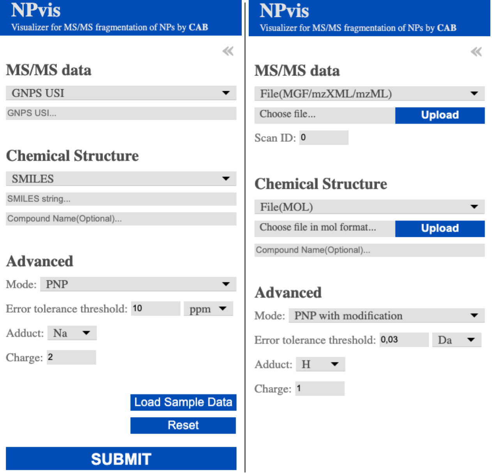

## Web service usage

**NB!** This file provides hints on the NPvis [web service](http://cab.cc.spbu.ru/npvis/) usage. 
Please first read the [main README](../README.md) to get the general info about the tool and its inputs/outputs.  

### Controls

Most of the web service controls are located on a foldable left panel. The visible set depends on the selected data types, 
the figure below shows two possible views.  

You can provide a spectrum (MS/MS) via a [Universal Spectra Identifier](https://www.nature.com/articles/s41592-021-01184-6) (USI) 
or a file in the [MGF](https://fiehnlab.ucdavis.edu/projects/lipidblast/mgf-files), 
[mzXML](http://tools.proteomecenter.org/wiki/index.php?title=Formats:mzXML), and 
[mzML](https://www.psidev.info/mzML) format. The provided USI should be resolvable via the [Metabolomics Spectrum Identifier Resolver](https://metabolomics-usi.ucsd.edu/).
If a spectra file contains more than one spectrum, please specify the desired Scan ID (the first spectrum is used by default).

You can provide a compound chemical structure via 
a [SMILES](https://en.wikipedia.org/wiki/Simplified_molecular-input_line-entry_system) string 
(both canonical and isomeric SMILES are supported) or a file in the  
[MDL MOL V3000](http://biotech.fyicenter.com/1000250_What_Is_SDF_Mol_V3000_File_Format.html) format. 
If the compound name is specified, it will pop up in the report Metadata panel.

The advanced settings panel allows users to select 
* the NPvis running mode ("PNP" for exact compound-spectrum matches or "PNP with modification" where exact compound is unknown)
* max allowed MS/MS peak annotation error (the value and the relative/absolute type)
* ionisation adduct (H, Na, K)
* spectrum charge (only positively charged ions are currently supported)

The Load Sample Data button prefills the controls with the [CCMSLIB00000839197](https://gnps.ucsd.edu/ProteoSAFe/gnpslibraryspectrum.jsp?SpectrumID=CCMSLIB00000839197#%7B%7D) spectrum from the [GNPS spectral library](https://ccms-ucsd.github.io/GNPSDocumentation/gnpslibraries/) (via USI) 
and the [surugamide A](https://pubchem.ncbi.nlm.nih.gov/compound/71764189) structure (via SMILES). The match is supposed for the "PNP with modification" mode and all other parameters set as default, 
but you can tweak them if you want!

The Reset button reset all controls to default values.

The Submit button starts the processing, the resulting report will appear on the right within a few seconds.

### GET Requests

Our server supports HTML GET Requests. A valid request should contain a spectrum specified via USI, 
a compound in the SMILES format and the NPvis running parameters. 
The web server handles incoming requests and generates the NPvis reports in return. 

Valid examples are:
* CCMSLIB00000839197 vs surugamide A  

      http://cab.cc.spbu.ru/npvis/?smiles=CC[C@H](C)[C@H]1C(=O)N[C@@H](C(=O)N[C@H](C(=O)N[C@H](C(=O)N[C@@H](C(=O)N[C@@H](C(=O)N[C@H](C(=O)N[C@@H](C(=O)N1)C)[C@@H](C)CC)CC(C)C)CC2=CC=CC=C2)[C@@H](C)CC)CCCCN)[C@H](C)CC&gusi=mzspec:GNPS:GNPS-LIBRARY:accession:CCMSLIB00000839197&errthr=0.05&errtype=da

* CCMSLIB00000839197 vs surugamide B 

      http://cab.cc.spbu.ru/npvis/?smiles=CC[C@H](C)[C@@H]1NC(=O)[C@@H](C)NC(=O)[C@@H](NC(=O)[C@@H](CC(C)C)NC(=O)[C@@H](CC2=CC=CC=C2)NC(=O)C(NC(=O)[C@@H](CCCCN)NC(=O)[C@H](NC1=O)C(C)C)[C@@H](C)CC)[C@@H](C)CC&gusi=mzspec:GNPS:GNPS-LIBRARY:accession:CCMSLIB00000839197&errthr=0.05&errtype=da

So, you should prepend your request with `http://cab.cc.spbu.ru/npvis/?` and use the following keywords joined via the `&` sign:
* `smiles=` to specify the structure SMILES
* `gusi=` to specify the spectrum USI
* `errthr=0.05` to specify the maximum allowed MS/MS peak annotation error
* `errtype=da` to switch between the absolute (`da`) and relative (`ppm`) error threshold type